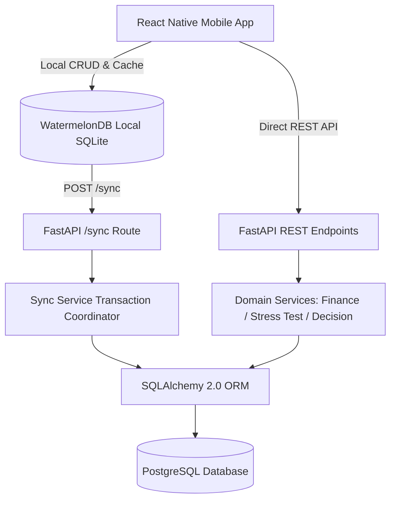

# ArthSetu / Vyapar Crash Test - Core API & Database (Phase 2)

> **"Prove the business before you borrow for it."**
> AI-powered pre-investment decision platform for rural and semi-urban micro-entrepreneurs.

---

## 1. Project Overview

Rural and semi-urban micro-entrepreneurs frequently take high-interest loans for unvalidated business ideas without testing real customer demand, unit economics, or resilience under cost spikes. **ArthSetu / Vyapar Crash Test** transforms this journey into a structured pre-investment decision process:

$$\text{DISCOVER} \longrightarrow \text{TEST} \longrightarrow \text{CRASH} \longrightarrow \text{VALIDATE} \longrightarrow \text{FINANCE} \longrightarrow \text{DECIDE}$$

### Phase Scope & Boundaries

* **Phase 1 (Mobile & Local Engine)**: React Native, WatermelonDB, TypeScript deterministic engine.
* **Phase 2 (This Task — Core API & Persistent Relational Store)**:
  * FastAPI (Python 3.12, Pydantic v2 validation)
  * PostgreSQL & SQLAlchemy 2.0 ORM
  * Alembic migrations
  * Deterministic Financial Engine (`Decimal` arithmetic for interest accrual, EMI, and loan caps)
  * Transactional, idempotent `POST /sync` for WatermelonDB
  * Comprehensive Docker & Docker Compose setup (`api` + `postgres`)
  * Pytest test suite & database seeding script
* **Phase 3 (Upcoming — Background Jobs)**: Redis, Celery (Strictly excluded from Phase 2).
* **Phase 4 (Upcoming — Multi-Agent AI System)**: pgvector, RAG, LangGraph, Azure OpenAI / AWS Bedrock, Instructor, LangSmith (Strictly excluded from Phase 2).

---

## 2. Architecture & Data Flow



---

## 3. Entity-Relationship (ER) Diagram

```mermaid
erDiagram
    LOCATIONS ||--o{ USERS : "resides_in"
    LOCATIONS ||--o{ BUSINESSES : "located_at"
    LOCATIONS ||--o{ MARKET_DATA : "has_data"
    USERS ||--o{ BUSINESSES : "owns"
    BUSINESSES ||--o{ MARKET_DATA : "observed_for"
    BUSINESSES ||--o{ BUSINESS_ASSUMPTIONS : "has_versions"
    BUSINESSES ||--o{ STRESS_TESTS : "undergoes"
    BUSINESS_ASSUMPTIONS ||--o{ STRESS_TESTS : "base_for"
    STRESS_TESTS ||--o{ STRESS_TEST_SCENARIOS : "contains"
    BUSINESSES ||--o{ PILOTS : "validates_with"
    PILOTS ||--o{ PILOT_RESULTS : "produces"
    SCHEMES ||--o{ SCHEME_RULES : "governed_by"
    BUSINESSES ||--o{ FINANCE_ASSESSMENTS : "evaluated_under"
    SCHEMES ||--o{ FINANCE_ASSESSMENTS : "applied_scheme"
    SCHEME_RULES ||--o{ FINANCE_ASSESSMENTS : "applied_rule"
    BUSINESSES ||--o{ EVIDENCE : "supported_by"
    BUSINESSES ||--o{ DECISIONS : "concluded_with"

    USERS {
        string id PK
        string name
        string phone
        string location_id FK
        numeric available_capital
        json skills
        string experience
        json assets
        integer family_workforce
        json preferences
        string risk_tolerance
        datetime created_at
        datetime updated_at
    }

    LOCATIONS {
        string id PK
        string state
        string district
        string block
        string village_or_city
        numeric latitude
        numeric longitude
        datetime created_at
        datetime updated_at
    }

    BUSINESSES {
        string id PK
        string user_id FK
        string location_id FK
        string business_name
        string business_category
        text description
        string status
        datetime created_at
        datetime updated_at
    }

    MARKET_DATA {
        string id PK
        string location_id FK
        string business_id FK
        string data_type
        string source
        numeric value
        string unit
        date observation_date
        numeric confidence
        boolean is_observed
        boolean is_estimated
        json metadata_json
        datetime created_at
    }

    SCHEMES {
        string id PK
        string scheme_name
        string scheme_type
        text description
        boolean active
        datetime created_at
        datetime updated_at
    }

    SCHEME_RULES {
        string id PK
        string scheme_id FK
        numeric min_project_cost
        numeric max_project_cost
        numeric financing_percentage
        numeric max_loan_amount
        numeric annual_interest_rate
        integer tenure_months
        integer moratorium_months
        date effective_from
        date effective_to
        boolean active
        datetime created_at
        datetime updated_at
    }

    BUSINESS_ASSUMPTIONS {
        string id PK
        string business_id FK
        integer expected_customers
        numeric selling_price
        numeric production_volume
        numeric raw_material_cost
        numeric labour_cost
        numeric rent
        numeric transport_cost
        numeric working_capital
        numeric proposed_loan_amount
        numeric other_operating_cost
        string assumption_source
        numeric confidence
        datetime created_at
        datetime updated_at
    }

    STRESS_TESTS {
        string id PK
        string business_id FK
        string base_assumption_id FK
        string name
        text description
        string status
        datetime created_at
        datetime updated_at
    }

    STRESS_TEST_SCENARIOS {
        string id PK
        string stress_test_id FK
        string scenario_type
        string parameter_name
        numeric change_percentage
        numeric change_absolute
        numeric revenue
        numeric operating_cost
        numeric cash_surplus
        numeric debt_repayment_burden
        numeric working_capital_pressure
        numeric break_even
        numeric resilience_score
        string result_status
        datetime created_at
    }

    PILOTS {
        string id PK
        string business_id FK
        text objective
        text hypothesis
        integer duration_days
        string status
        date start_date
        date end_date
        datetime created_at
        datetime updated_at
    }

    PILOT_RESULTS {
        string id PK
        string pilot_id FK
        integer target_customers
        integer actual_customers
        numeric repeat_purchase_rate
        numeric price_acceptance
        numeric delivery_cost
        numeric conversion_rate
        numeric actual_revenue
        numeric actual_cost
        text customer_feedback
        text observations
        datetime created_at
    }

    FINANCE_ASSESSMENTS {
        string id PK
        string business_id FK
        string scheme_id FK
        string scheme_rule_id FK
        numeric project_cost
        numeric margin_contribution
        numeric maximum_loan
        numeric recommended_loan
        numeric annual_interest_rate
        integer total_tenure_months
        integer moratorium_months
        integer active_repayment_months
        numeric capitalized_principal
        numeric emi
        numeric total_interest
        string debt_affordability_status
        numeric debt_service_burden
        numeric working_capital_requirement
        integer calculation_version
        datetime created_at
    }

    EVIDENCE {
        string id PK
        string business_id FK
        string evidence_type
        string source
        text description
        numeric value
        numeric confidence
        boolean is_observed
        boolean is_estimated
        datetime created_at
    }

    DECISIONS {
        string id PK
        string business_id FK
        string decision
        text rationale
        numeric confidence
        json evidence_summary
        json assumptions_summary
        json financial_risk_summary
        datetime created_at
    }

    SYNC_RECORDS {
        string id PK
        string client_id
        string entity_type
        string entity_id
        string operation
        bigint client_timestamp
        bigint server_timestamp
        string sync_status
        string payload_hash
    }
```



---

## 4. Deterministic Financial Engine

All financial calculations are implemented strictly in Python using Python's `Decimal` type with `ROUND_HALF_UP` precision.

### 4.1 Project Cost & Financing Limits
$$\text{Project Cost} = \frac{\text{Margin Contribution}}{0.10} \quad \text{or} \quad \text{Margin Contribution} = \text{Project Cost} \times 0.10$$
$$\text{Raw Loan} = \text{Project Cost} \times \frac{\text{Financing \%}}{100}$$
$$\text{Maximum Loan} = \min(\text{Raw Loan}, \text{Scheme Rule Max Loan Cap})$$

### 4.2 Configured Scheme Rules (Stored as Data)
1. **Micro Finance Scheme**:
   * Project Cost: Up to ₹1,40,000
   * Financing: Up to 90% (Maximum Loan: ₹1,25,000)
   * Annual Interest Rate: 6.50%
   * Total Tenure: 36 months (3 years)
   * Moratorium: 3 months
2. **Term Loan Scheme**:
   * Project Cost: > ₹1,40,000 up to ₹50,00,000
   * Financing: Up to 90% (Maximum Loan: ₹45,00,000)
   * Annual Interest Rate: 8.00%
   * Total Tenure: 84 months (7 years)
   * Moratorium: 6 months

### 4.3 Moratorium Accrual & Capitalized Principal
$$\text{Monthly Rate } i = \frac{\text{Annual Rate}}{12 \times 100}$$
$$\text{Accrued Moratorium Interest} = \text{Loan} \times i \times \text{Moratorium Months}$$
$$\text{Capitalized Principal } P_{\text{cap}} = \text{Loan} + \text{Accrued Moratorium Interest}$$
$$\text{Active Repayment Months } N_{\text{active}} = \text{Total Tenure Months} - \text{Moratorium Months}$$

### 4.4 Equated Monthly Installment (EMI)
$$\text{EMI} = \frac{P_{\text{cap}} \cdot i \cdot (1 + i)^{N_{\text{active}}}}{(1 + i)^{N_{\text{active}}} - 1}$$

### 4.5 Maximum vs Recommended Borrowing
The engine evaluates Debt Service Coverage against monthly net operating cash surplus ($\text{Revenue} - \text{Operating Costs}$):
* **$\text{AFFORDABLE}$**: $\text{EMI} \le 35\%$ of monthly cash surplus $\longrightarrow \text{Recommended Loan} = \text{Maximum Loan}$.
* **$\text{STRETCHED}$**: $35\% < \text{EMI} \le 50\%$ of monthly surplus $\longrightarrow \text{Recommended Loan} = \text{Maximum Loan} \times 0.80$.
* **$\text{UNSUSTAINABLE}$**: $\text{EMI} > 50\%$ of monthly surplus $\longrightarrow \text{Recommended Loan} = \text{Maximum Loan} \times 0.50$.

---

## 5. WatermelonDB Synchronization (`POST /sync`)

The sync endpoint accepts native WatermelonDB client sync payloads and executes changes in an atomic database transaction.

### Sync Protocol Payload
```json
{
  "changes": {
    "locations": { "created": [], "updated": [], "deleted": [] },
    "users": { "created": [], "updated": [], "deleted": [] },
    "businesses": { "created": [], "updated": [], "deleted": [] },
    "business_assumptions": { "created": [], "updated": [], "deleted": [] },
    "market_data": { "created": [], "updated": [], "deleted": [] },
    "stress_tests": { "created": [], "updated": [], "deleted": [] },
    "stress_test_scenarios": { "created": [], "updated": [], "deleted": [] },
    "pilots": { "created": [], "updated": [], "deleted": [] },
    "pilot_results": { "created": [], "updated": [], "deleted": [] },
    "evidence": { "created": [], "updated": [], "deleted": [] }
  },
  "lastPulledAt": 1724920000000
}
```

### Safety & Integrity Guarantees
1. **Topological Dependency Order**: Creates and updates are processed in strict parent-to-child order (`locations` $\rightarrow$ `users` $\rightarrow$ `businesses` $\rightarrow$ `assumptions` $\rightarrow$ `pilots` $\rightarrow$ `results`).
2. **Reverse Deletion Order**: Deletes are executed from child tables up to parents to avoid foreign-key constraint errors.
3. **Idempotency**: Requests track payload hashes in `sync_records`. Duplicate sync payloads produce zero duplicate rows.
4. **All-or-Nothing Transaction**: If any entity creation or validation fails, the entire transaction is rolled back.

---

## 6. REST API Endpoints

| Method | Endpoint | Description |
| :--- | :--- | :--- |
| `GET` | `/health` | API health check and DB connectivity status |
| `POST` | `/users` | Create new entrepreneur user |
| `GET` | `/users` | List users |
| `GET` | `/users/{user_id}` | Retrieve user profile |
| `GET` | `/users/{user_id}/businesses` | Get all businesses of a user |
| `POST` | `/locations` | Create location |
| `GET` | `/locations` | List locations |
| `POST` | `/businesses` | Register business idea |
| `GET` | `/businesses` | List businesses |
| `GET` | `/businesses/{business_id}` | Retrieve business details |
| `POST` | `/businesses/{business_id}/assumptions` | Add versioned business assumptions |
| `GET` | `/businesses/{business_id}/assumptions` | List historical assumptions (audit trail) |
| `GET` | `/schemes` | List government schemes & active rules |
| `GET` | `/schemes/{scheme_id}` | Get specific scheme details |
| `POST` | `/schemes` | Create financing scheme |
| `POST` | `/schemes/{scheme_id}/rules` | Add configurable scheme rule |
| `POST` | `/businesses/{business_id}/stress-tests` | Run deterministic Crash Test scenarios |
| `GET` | `/stress-tests/{stress_test_id}` | Get crash test session & scenario results |
| `POST` | `/businesses/{business_id}/pilots` | Plan a 14-day real-world pilot |
| `GET` | `/businesses/{business_id}/pilots` | List business validation pilots |
| `POST` | `/pilots/{pilot_id}/results` | Record actual pilot customer & sales data |
| `POST` | `/businesses/{business_id}/finance-assessment` | Compute deterministic financial assessment |
| `GET` | `/businesses/{business_id}/finance-assessment` | Get latest financial assessment |
| `POST` | `/businesses/{business_id}/evidence` | Attach traceable market/pilot evidence |
| `GET` | `/businesses/{business_id}/evidence` | List traceable evidence points |
| `POST` | `/businesses/{business_id}/decision` | Synthesize pre-investment decision (GO/MODIFY/DO_NOT_INVEST_YET) |
| `GET` | `/businesses/{business_id}/decision` | Get latest pre-investment decision |
| `POST` | `/sync` | WatermelonDB synchronization endpoint |

---

## 7. Quickstart & Execution Guide

### Option A: Local Development with `uv`

```bash
# 1. Clone repository and navigate to backend
cd backend

# 2. Run test suite
uv run pytest -v

# 3. Run database migrations
uv run alembic upgrade head

# 4. Seed demo data (Schemes, rules, Latur location, Ramesh Patil demo dairy)
uv run python scripts/seed_database.py

# 5. Start FastAPI development server
uv run uvicorn app.main:app --host 0.0.0.0 --port 8000 --reload
```

### Option B: Running with Docker Compose

```bash
# From workspace root
docker compose up --build
```

### Accessing Swagger UI
* Interactive API Documentation: [http://localhost:8000/docs](http://localhost:8000/docs)
* Alternative ReDoc UI: [http://localhost:8000/redoc](http://localhost:8000/redoc)

---

## 8. Future Phase Compatibility

* **Phase 3**: Schema is prepared for asynchronous processing queues with Celery and Redis caching.
* **Phase 4**: Schema natively supports multi-agent AI integration (pgvector embeddings on `evidence` and `market_data`, LangGraph supervisor orchestrating Market Analyst and Risk Actuary agents) without altering core relational structures.
